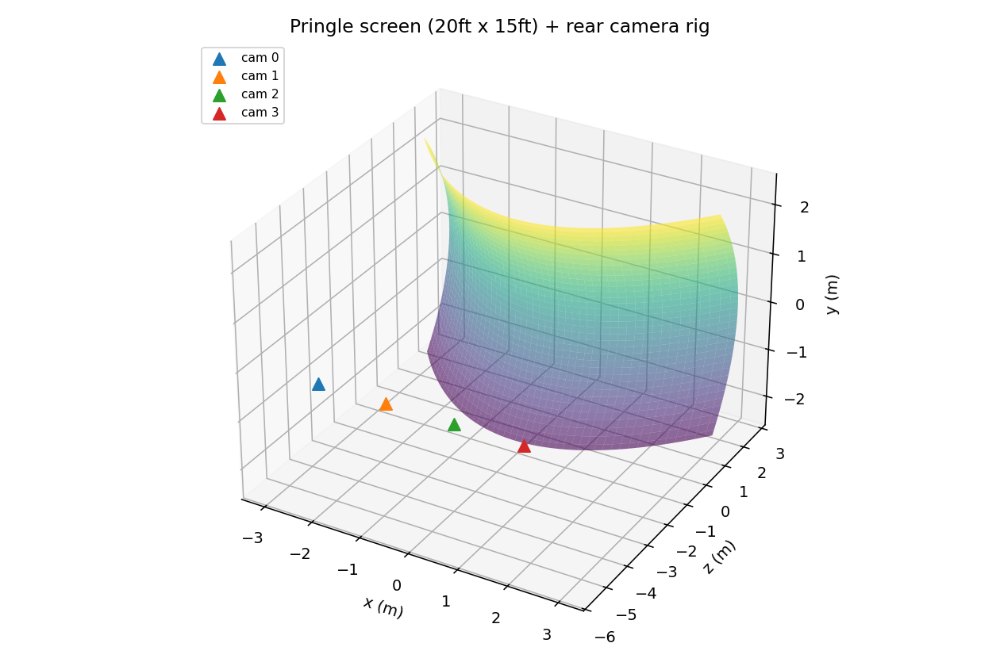
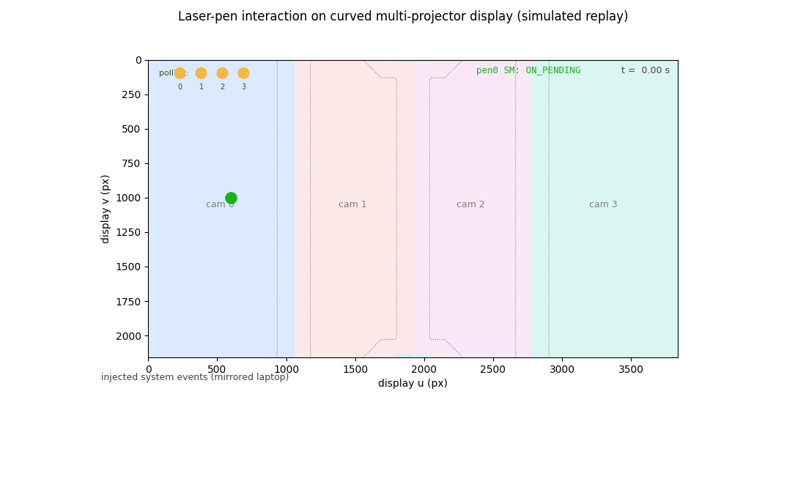

# Ambient light tolerant laser-pen based interaction with curved multi-projector displays — Simulated Implementation (Unofficial)

> **⚠️ Unofficial code.** This is an *unofficial, simulation-only* re-implementation
> of the paper below, released for the general audience. The **original system is
> proprietary**: it was a sophisticated **C++** codebase running against real
> hardware — multi-projector pringle-shaped rear-projection screens, FLIR Blackfly
> feedback cameras, and multi-colored laser pens — and cannot be published.
> Everything here (screen, cameras, lasers, users) is **simulated in Python**;
> only the algorithms of the paper are implemented for real.

**Paper:**

> S. Thakur, M. Urs, M. T. Ibrahim, A. Sidenko, A. Majumder.
> **"Ambient Light Tolerant Laser-Pen Based Interaction with Curved
> Multi-Projector Displays."** *Human-Computer Interaction. Technological
> Innovation (HCII 2022)*, LNCS vol. 13303, pp. 180–194, Springer, Cham.
> DOI: [10.1007/978-3-031-05409-9_14](https://doi.org/10.1007/978-3-031-05409-9_14)
> ([Springer page](https://link.springer.com/chapter/10.1007/978-3-031-05409-9_14))

## Simulated rig

The simulated setup mirrors the paper's: a 15 ft × 20 ft pringle-shaped
(hyperbolic-paraboloid) rear-projection screen observed by a linear array of
feedback cameras behind it.



## Live session replay

`python main.py demo` renders an animated replay of a full interaction
session — the laser pen moving across the partitioned display while gestures
are interpreted in real time. Watch the polling lamps (partition-aware camera
polling), the state machine transitions, gesture banners (SINGLE CLICK /
DOUBLE CLICK / DRAG), camera hand-offs at partition boundaries, and the
injected system events on the mirrored laptop:



## What is simulated vs. implemented

| Component | Status |
|---|---|
| 15 ft × 20 ft pringle screen (hyperbolic paraboloid) | **Simulated** analytically — stands in for the structured-light screen reconstruction the paper assumes from prior work [1–5] |
| Feedback cameras (pinhole optics + radiometric exposure model with saturation, noise, grazing-angle foreshortening) | **Simulated** |
| Laser pens (color, ON/OFF, hand jitter) and scripted users | **Simulated** |
| Ambient light estimation via projected-black capture (Sec 2.1a) | **Implemented** |
| Reference-exposure search + exposure prediction, Eq. 1 (Sec 2.1b–c) | **Implemented** |
| Black-frame subtraction in every tracking frame | **Implemented** |
| Display ↔ camera registration maps with sub-pixel inverse (Gauss–Newton) | **Implemented** (geometry known by construction, as reconstruction output would be) |
| Nearest-camera display partitioning + boundary bands (Sec 2.2, Fig 3/4a) | **Implemented** |
| Multi-threaded per-camera detection workers + partition-aware polling coordinator | **Implemented** (real threads, per-tick barrier for reproducibility) |
| Real-time camera hand-off across partitions | **Implemented** |
| Camera-failure watchdog + repartitioning (survivors absorb the lost region) | **Implemented** |
| Gesture state machine: single/double/triple click, drag (Fig 4b, t < x < T) | **Implemented** |
| Action mapping to system controls (click/double/scroll/drag) + rebinding | **Implemented** |
| VNC-style mirroring sink (display coords → tethered laptop coords, Sec 4.3) | **Implemented** |
| Multi-user via colored lasers (balloon-pop scoring demo, Sec 4.3) | **Implemented** |
| Custom drag-gesture template matching (paper's future-work section) | **Implemented** (simple $1-style matcher) |

## Quick start

```bash
pip install numpy scipy matplotlib pillow    # pytest optional
python main.py demo        # end-to-end session + figures/ + animated replay GIF
python main.py live        # same session in a live interactive window
python main.py table1      # exposure vs ambient light (Table 1 analogue)
python main.py detection   # 8x8 laser detection accuracy grid (slow)
python main.py gestures    # click recognition accuracy
python main.py location    # sub-pixel localization error
python main.py failure     # kill a camera mid-run; interaction continues
python main.py multiuser   # two colored pens, per-user scoring
python tests/test_core.py  # unit tests (uses pytest if installed)
```

## Pipeline

```
ScriptedUser ─▶ LaserPen ─▶ SceneState
                              │  (per tick, real threads)
              ┌───────────────┴────────────────┐
              ▼                                ▼
       CameraWorker[0..n]              (one thread per camera)
       capture ▶ black-subtract ▶ threshold ▶ blob centroid
       ▶ camera-px → display-uv (registration inverse map)
              │ detections + heartbeats
              ▼
       TrackingCoordinator
       partition-aware polling · boundary hand-off · failure watchdog
              ▼ TrackSample(t, pen, uv, on)
       PenStateMachine (per pen)  →  GestureEvent
              ▼
       ActionMapper  →  VirtualDesktop / VNCMirrorSink
```

Module map (mirrors the original C++ decomposition the author describes):

- `laserpen/surface.py` — screen reconstruction stand-in + 3D↔2D parametrization
- `laserpen/camera.py` — simulated cameras (optics + radiometry)
- `laserpen/registration.py` — camera↔display maps ("warping" data)
- `laserpen/ambient.py` — ambient estimation + exposure prediction (Eq. 1)
- `laserpen/partition.py` — display partitioning, boundary bands, repartition
- `laserpen/tracker.py` — multi-thread camera handling, detection, hand-off
- `laserpen/state_machine.py` — action interpretation
- `laserpen/actions.py` — action mapping to system controls + execution
- `laserpen/engine.py` — orchestration
- `laserpen/experiments.py` — the paper's evaluation protocol
- `laserpen/visualize.py` — figures (rig, partitions, heatmaps, trajectories)
- `laserpen/animate.py` — animated replay of a session (GIF/MP4/live window):
  laser dot + trail moving over the partitioned display, per-tick camera
  polling lamps, live state-machine state, gesture banners, hand-off
  flashes, and the injected-system-event ticker. Everything shown is the
  recorded simulation data — nothing is staged.

## Results reproduced (in simulation)

- **Exposure vs ambient (Table 1 trend):** reference exposure `Er` decreases
  as ambient light rises; predicted pattern exposure `Ei` maintains the
  Eq.-1 relation and snaps to the discrete exposure ladder.
- **Detection accuracy (Sec 4.2):** ~100% across the 8×8 grid. The paper
  reports 98.21% overall with degradation at edges from grazing camera
  angles; a foreshortening model is included, but the simulation lacks lens
  vignetting/MTF so edges remain easier than in reality.
- **Gesture accuracy:** 100% single/double click recognition (paper: >98%).
- **Localization:** ~0.1 camera-pixel mean error via blob-centroid +
  Gauss–Newton inverse mapping (paper: 0.94 px mean) — the simulated sensor
  is cleaner than a real one.
- **Hand-off & scalability:** partition-aware polling issues ~30% fewer
  camera polls than poll-everyone, with seamless owner hand-offs logged as
  the laser crosses partitions.
- **Failure recovery:** killing a camera mid-run triggers automatic
  repartitioning; 20/20 scripted clicks still recognized.
- **Multi-user:** two colored pens correctly attributed; 12/12 balloons
  popped with a 6–6 score.

## Honest deltas from the real system

Simulation is idealized: no lens distortion/vignetting, no rolling shutter,
no projector black-offset spatial variation, no inter-reflection, and color
attribution of pens uses proximity to ground truth rather than per-band color
segmentation of a Bayer image. Numbers above should be read as "the
algorithms work," not as hardware benchmarks. The threading model is
tick-synchronized for reproducibility; the real system ran free-running
camera threads at 45–55 FPS.

## Relation to the real system

To be explicit: this repository is **only a simulation** of the actual
hardware system. The real deployment used physical projectors, curved
screens, machine-vision cameras and laser pens, driven by a substantially
more sophisticated **C++** codebase (multi-threaded camera capture against
real sensors, GPU warping/blending, OS-level event injection, capture-card
mirroring). The Python code here reproduces the *algorithms and system
architecture* of the paper so they can be studied, tested and extended
without any of that hardware. Accuracy numbers reported by this simulation
reflect an idealized world and should not be compared 1:1 with the hardware
results in the paper.

## Citation

If you found this code or the ideas in it useful, please cite our paper:

```bibtex
@inproceedings{thakur2022ambient,
  author    = {Thakur, Sarvesh and Urs, Meghana and Ibrahim, Muhammad Twaha
               and Sidenko, Alexander and Majumder, Aditi},
  title     = {Ambient Light Tolerant Laser-Pen Based Interaction with
               Curved Multi-projector Displays},
  booktitle = {Human-Computer Interaction. Technological Innovation
               (HCII 2022)},
  series    = {Lecture Notes in Computer Science},
  volume    = {13303},
  pages     = {180--194},
  publisher = {Springer, Cham},
  year      = {2022},
  doi       = {10.1007/978-3-031-05409-9_14}
}
```

## License

MIT — this is a clean-room, unofficial re-implementation from the published
paper, for educational and research use.
